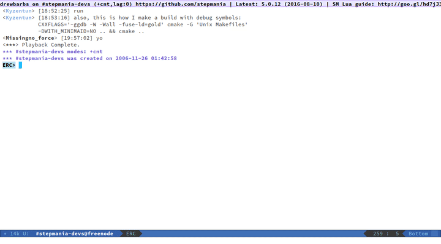
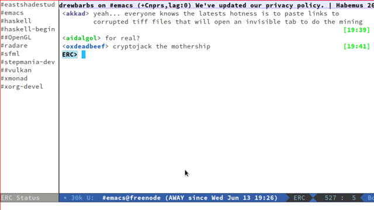

# `erc-status-sidebar`

[](https://melpa.org/#/erc-status-sidebar)

A [hexchat](https://hexchat.github.io/)-like activity overview for ERC
channels. This an alternative view for the `erc-track` module. It
displays all the same information `erc-track` puts in the mode line, but
can be relegated to a single frame dedicated to IRC.



## Installation

### From MELPA

1. Follow the guide at https://melpa.org/#/getting-started to add the
   MELPA package repository
2. Run `M-x package-list-packages` and select/install the `erc-status-sidebar` package

### Manually

1. Fetch the `erc-status-sidebar.el` repository

   ```bash
   git clone https://github.com/drewbarbs/erc-status-sidebar.git
   ```

2. Load it in your emacs init file

   ```el
   (add-to-list 'load-path "/path/to/erc-status-sidebar")
   (require 'erc-status-sidebar)
   ```

## Usage

To open the ERC status sidebar in the current frame use `M-x
erc-status-sidebar-open` (or `erc-status-sidebar-toggle`). Ensure the
`erc-track` module is active (a member of `erc-modules`). This is the
default setting for ERC.

To close the sidebar on the current frame use `M-x
erc-status-sidebar-close` (or `erc-status-sidebar-toggle`). Provide a
prefix argument to close the sidebar on all frames.

To kill the sidebar buffer and close the sidebar on all frames, use
`M-x erc-status-sidebar-kill`.

## Configuration

To specify a list message types that *do not* update the status
sidebar (e.g. `JOIN` and `PART` messages), update the "Erc Track
Exclude Types" custom setting: `M-x customize-group <RET> erc-track`.

### Using a single window for ERC buffers
Sometimes (very often in Emacs 26.1), the
`switch-to-buffer-other-window` function used by `erc-status-sidebar`
to display chat buffers will split an existing ERC window like this:



The intent of this package is to provide
a hexchat-like experience for ERC users, and hexchat only has the
equivalent of one chat window, so this is undesirable.

To direct Emacs to use an existing ERC window (rather than creating a
new one) add something like the following to your emacs init file:

```el
(defun my/erc-window-reuse-condition (buf-name action)
  (with-current-buffer buf-name
    (if (eq major-mode 'erc-mode)
        ;; Don't override an explicit action
        (not action))))

(add-to-list 'display-buffer-alist
             '(my/erc-window-reuse-condition .
               ;; NOTE: display-buffer-reuse-mode-window only
               ;; available in Emacs 26+
               (display-buffer-reuse-mode-window
                (inhibit-same-window . t)
                (inhibit-switch-frame . t)
                (mode . erc-mode))))
```

If using Emacs < 26, you can copy an implementation of
`display-buffer-reuse-mode-window` (called
`display-buffer-reuse-major-mode-window`) from
https://stackoverflow.com/a/28311686/756104

## Acknowledgments

Credit to [`sidebar.el`](https://github.com/sebastiencs/sidebar.el)
and [`outline-toc.el`](https://github.com/abingham/outline-toc.el),
from which all the sidebar window management ideas were lifted.

## License

[GNU General Public License v3](https://www.gnu.org/licenses/gpl-3.0.en.html)
